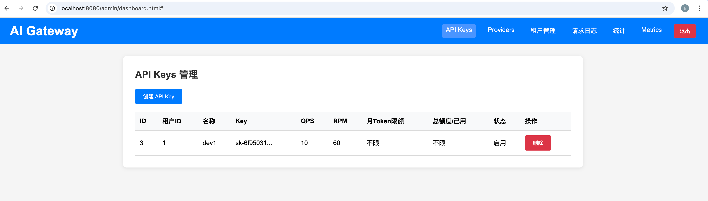
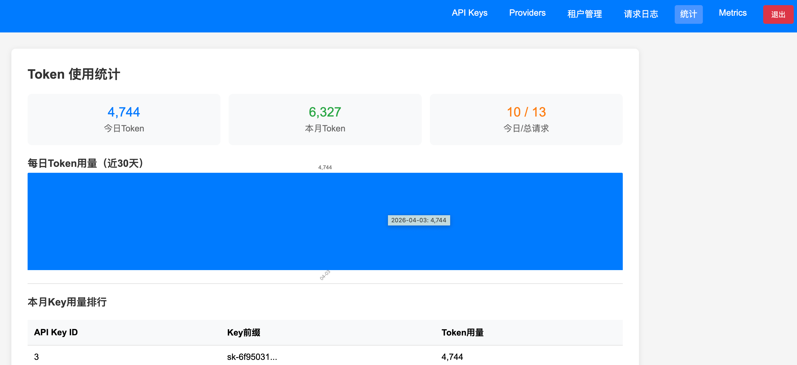

# AI Gateway

AI LLM大模型网关系统，支持多租户管理、API Key管理、限流、日志审计等核心功能。

## 功能特性

- 多租户管理
- 虚拟API Key配置和删除
- 请求日志和审计
- Token消费统计
- 流量控制和限流
- 用户注册登录
- JWT身份认证
- RBAC权限管理
- 数据加密和脱敏

## 技术栈

- Go 1.24+
- Gin Web框架
- GORM ORM
- Redis缓存
- MySQL数据库
- JWT认证

## 快速开始

1. 安装依赖
```bash
go mod tidy
```

2. 初始化db
```shell
# 进入mysql终端后，执行该命令
source db.sql
```

3. 配置数据库
修改 `app.yaml` 中的数据库和redis连接信息

3. 运行
```bash
go run cmd/web/main.go
```
# tokens job
用于同步tokens消费情况
```shell
go run cmd/job/main.go
```

## API接口

### 认证接口
- POST /auth/register - 用户注册
- POST /auth/login - 用户登录

### API Key管理
- POST /api/keys - 创建API Key
- GET /api/keys - 获取API Key列表
- DELETE /api/keys/:id - 删除API Key

### 网关代理
- POST /v1/chat/completions - AI模型请求代理
- 请求demo见client中代码

# 管理后台
访问地址：localhost:8080/admin 输入用户名和密码登录即可



# 项目进度
目前支持openai风格的请求，后续将逐步接入各大模型provider请求，实现chat/image/video等功能。
